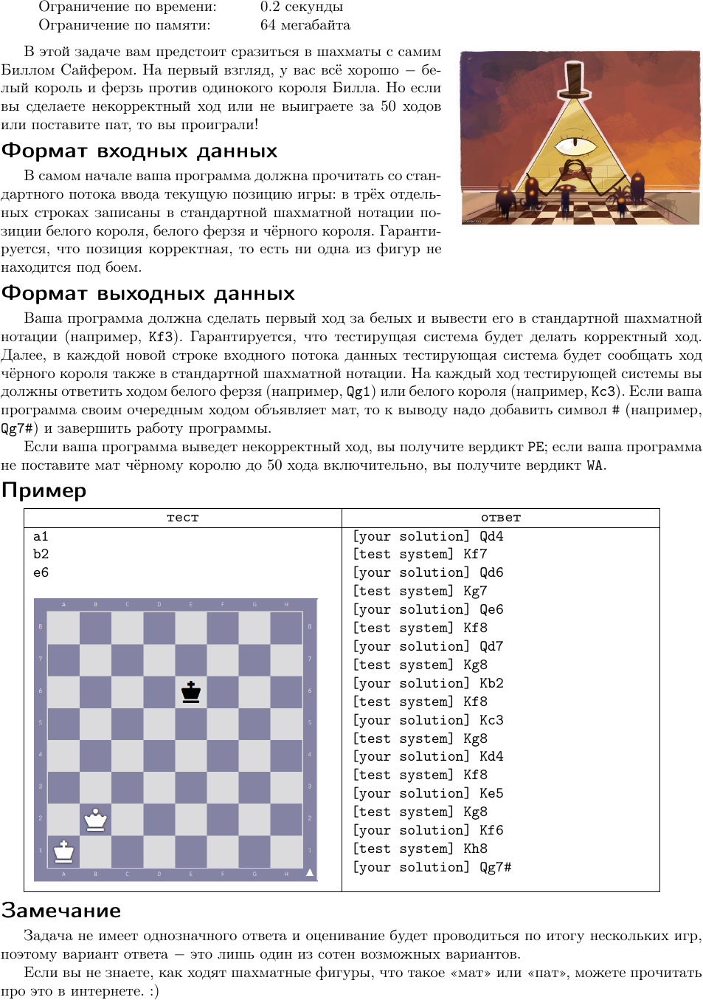
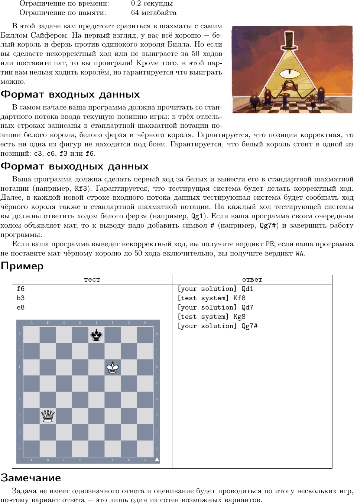

# Задача Партия в шахматы с Биллом (KhCup XVIII 2021)

Данная задача имеет две модификации: первая партия и вторая партия (можно ходить только ферзём).

## Первая партия в шахматы с Биллом




## Вторая партия в шахматы с Биллом




## Как запустить?

### Запуск вручную

1. Создать файл `answer.txt` в папке `chess-interactor`, куда записать начальные позиции белого короля, белого ферзя и чёрного короля.
2. Скомпилировать и запустить chess-interactor (нужен компилятор Rust):

    ```bash
    $ cd chess-interactor
    $ cargo run --release
    ```
3. Скомпилировать и запустить решение (в отдельном окне)
4. Вручную переписывать вывод из chess-interactor в решение и обратно


### Запуск автоматически (только на Linux) с использованием DDOTS-runner

1. Скомпилировать chess-interactor (нужен компилятор Rust):

    ```bash
    $ cd chess-interactor
    $ cargo build --release
    ```
2. Скопировать исполняемый файл из `target/release/chess-interactor` в папку `problem-I/`
3. Скачать и распаковать [ddots-runner](https://gitlab.com/dots.org.ua/ddots-runner/-/jobs/343795772/artifacts/download)
4. Скомпилировать решение
5. Запустить:

    ```bash
    $ sudo env RUST_LOG=trace ./ddots-runner \
        --problem-root ./problem-I \
        --solution-filepath ./solution \
        --semitrusted-service-sandbox-user "$(whoami)"
    ```

    , где `./solution` - это путь к исполняемому файлу решения
